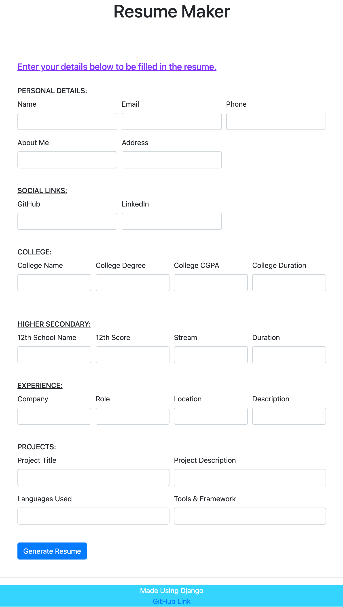

# Resume Maker

A simple resume maker made using Django that takes input(details) from the user using the form:

The app generates the corresponding resume using the details entered in the form. [This](https://github.com/Anusha1790/Resume_Maker/blob/main/demo-generate_%20resume.pdf) is an example of a resume generated using this Django app.
