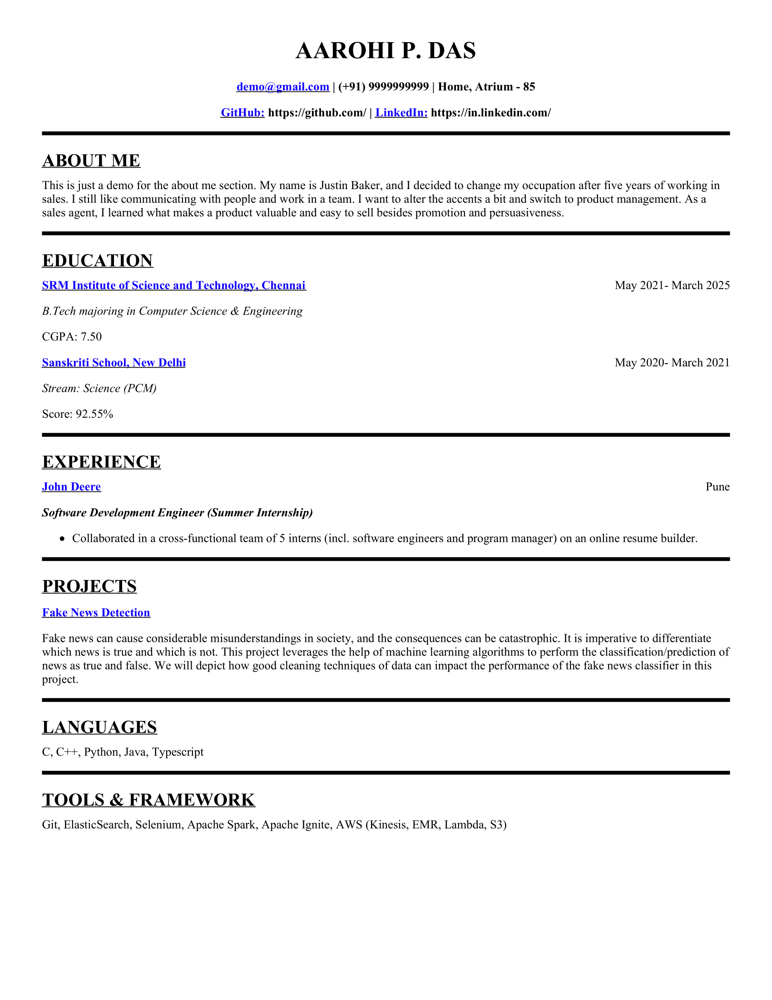

# Resume Maker

A simple resume maker made using Django that takes input(details) from the user using the form:

The app generates the corresponding resume using the details entered in the form. 

An example of a resume generate using this Django WebApp is shown below.

